# LINUX COMMANDS LAB REPORT

**Course:** Operating Systems Lab  
**Date:** December 10, 2025  
**Submitted by:** Salina  
**Roll No:** 34

---

## INTRODUCTION

### 1. What is Linux?

Linux is a free and open-source Unix-like operating system kernel first created by Linus Torvalds in 1991. It forms the core of various Linux distributions (distros) such as Ubuntu, Fedora, Debian, and CentOS. Linux is known for its stability, security, and flexibility, making it the preferred choice for servers, embedded systems, supercomputers, and increasingly for desktop environments.

The Linux operating system consists of three main components:
- **Kernel:** The core that manages system resources, memory, processes, and hardware
- **System Libraries:** Special functions and programs that applications use to access kernel features
- **System Utilities:** Programs that perform specialized management tasks

Linux follows a multi-user, multitasking architecture where multiple users can work simultaneously, and multiple processes can run concurrently. This makes it ideal for studying operating system concepts like process management, memory management, file systems, and inter-process communication.

### 2. The Linux Hierarchical File System

Linux uses a hierarchical tree-like file system structure, starting from the root directory denoted by `/`. Unlike Windows with multiple drive letters (C:, D:, etc.), everything in Linux exists under a single root directory. Key directories include:

- **/ (root):** The top-level directory of the entire file system
- **/home:** Contains personal directories for all users
- **/bin:** Essential binary executables and commands
- **/sbin:** System binaries used for system administration
- **/etc:** Configuration files for the system and applications
- **/var:** Variable data like logs, temporary files, and databases
- **/tmp:** Temporary files that are deleted on reboot
- **/usr:** User programs, libraries, and documentation
- **/proc:** Virtual file system providing process and system information
- **/dev:** Device files representing hardware components
- **/lib:** Shared library files needed by system programs

This hierarchical structure provides a clear organization and makes navigation logical and efficient.

### 3. Importance of Linux Commands in Operating Systems

Understanding Linux commands is crucial for operating system studies because:

**Process Management:** Linux commands allow direct interaction with the kernel for creating, monitoring, and terminating processes, which is fundamental to understanding CPU scheduling, context switching, and process states.

**Memory Management:** Commands help visualize physical and virtual memory usage, buffer caches, and swap space, demonstrating concepts like paging, segmentation, and memory allocation.

**File System Operations:** Through commands, students can explore inode structures, file permissions, directory hierarchies, and understand how the OS manages persistent storage.

**System Calls and APIs:** Many Linux commands are wrappers around system calls, providing practical insight into how user space interacts with kernel space.

**Concurrency and Synchronization:** Commands for managing threads and processes demonstrate real-world implementations of synchronization mechanisms, deadlock scenarios, and race conditions.

**Performance Analysis:** Monitoring commands reveal bottlenecks, resource utilization, and system performance metrics essential for optimization.

For computer science students, mastering Linux commands bridges the gap between theoretical OS concepts and practical system administration, making it an invaluable skill for both academic understanding and professional development.

---

## LINUX COMMANDS BY CATEGORY

---

## CATEGORY 1: FILE SYSTEM NAVIGATION

### 1. pwd (Print Working Directory)

**Explanation:**  
The `pwd` command displays the absolute path of your current working directory. When you open a terminal, you start in your home directory (typically `/home/username`). This command helps you identify your current location within the file system hierarchy. The absolute path always starts from the root `/` directory and shows the complete directory chain to your current position.

**Command:**
```bash
pwd
```

**Screenshot:**  


---

### 2. ls (List Directory Contents)

**Explanation:**  
The `ls` command lists all files and directories in your current working directory. It shows the names of files and folders but does not provide detailed information by default. This is one of the most frequently used commands for navigating the file system. You can see what's inside a directory before entering it or performing operations on its contents.

**Command:**
```bash
ls
```

**Screenshot:**  
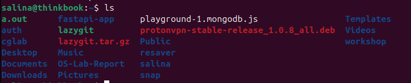

---

### 3. ls -a (List All Files Including Hidden)

**Explanation:**  
The `ls -a` option displays all files, including hidden files and directories. In Linux, hidden files start with a dot (`.`) such as `.bashrc`, `.profile`, or `.config`. These files typically contain configuration settings for applications and the shell. The command also shows `.` (current directory) and `..` (parent directory), which are special directory entries present in every directory.

**Command:**
```bash
ls -a
```

**Screenshot:**  
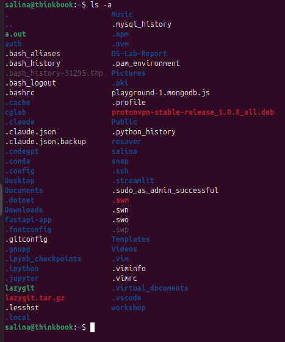

---

### 4. ls -l (Long Listing Format)

**Explanation:**  
The `ls -l` command provides detailed information about files and directories. The output includes file permissions, number of hard links, owner name, group name, file size in bytes, modification date and time, and the filename. The first character indicates file type: `-` for regular file, `d` for directory, `l` for symbolic link. The next nine characters represent read (r), write (w), and execute (x) permissions for owner, group, and others.

**Command:**
```bash
ls -l
```

**Screenshot:**  
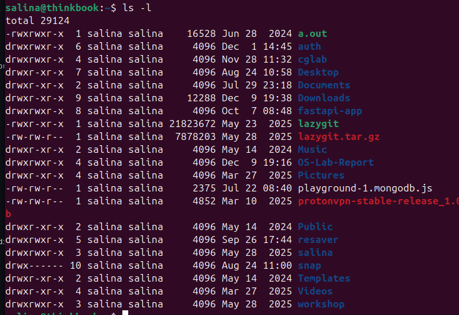

---

### 5. cd (Change Directory)

**Explanation:**  
The `cd` command changes your current working directory to a different location in the file system. You can use absolute paths (starting from `/`) or relative paths (relative to current directory). Common uses include `cd Documents` to enter a subdirectory, `cd ..` to move up one level to the parent directory, `cd ~` or just `cd` to return to your home directory, and `cd /` to go to the root directory.

**Command:**
```bash
cd Documents
cd ..
cd /home/username
cd ~
```

**Screenshot:**  
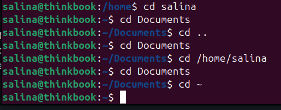

---

## CATEGORY 2: FILE AND DIRECTORY OPERATIONS

### 6. mkdir (Make Directory)

**Explanation:**  
The `mkdir` command creates new directories (folders) in the file system. You can create a single directory or multiple directories at once. Use `mkdir -p` to create parent directories if they don't exist. For example, `mkdir -p project/src/main` creates all intermediate directories. Directory names should not contain spaces unless quoted or escaped. This command is essential for organizing files into a logical structure.

**Command:**
```bash
mkdir myFolder
mkdir -p project/src/main
```

**Screenshot:**  
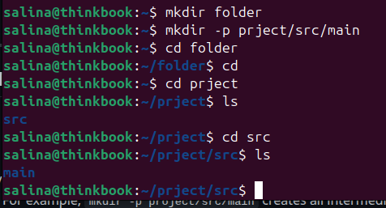

---

### 7. rmdir (Remove Empty Directory)

**Explanation:**  
The `rmdir` command deletes empty directories only. If a directory contains any files or subdirectories, the command will fail with an error message "Directory not empty". This safety feature prevents accidental deletion of important data. To remove directories with contents, you must use `rm -r` instead. Always verify the directory is truly empty before using this command, or check its contents with `ls`.

**Command:**
```bash
rmdir emptyFolder
```

**Screenshot:**  
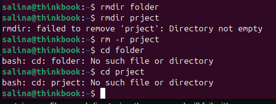

---

### 8. rm (Remove Files)

**Explanation:**  
The `rm` command permanently deletes files from the file system. Unlike Windows Recycle Bin, deleted files cannot be easily recovered, so use this command carefully. You can delete multiple files at once by listing them separated by spaces. The command supports wildcards like `*` (matches any characters) and `?` (matches single character). For example, `rm *.txt` deletes all text files in the current directory.

**Command:**
```bash
rm file.txt
rm file1.txt file2.txt
rm *.log
```

**Screenshot:**  
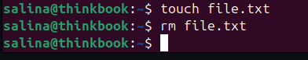

---

### 9. rm -r (Remove Directory Recursively)

**Explanation:**  
The `rm -r` command recursively deletes directories and all their contents, including subdirectories and files. The `-r` flag stands for "recursive". This is a powerful and dangerous command because it can delete large amounts of data quickly. Use `rm -ri` for interactive mode, which prompts before each deletion. Never run `rm -rf /` or `rm -rf *` as root, as this can destroy your entire system.

**Command:**
```bash
rm -r folderName
rm -ri folderWithContent
```

**Screenshot:**  
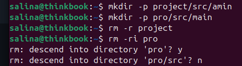

---

### 10. touch (Create Empty File)

**Explanation:**  
The `touch` command creates new empty files or updates the access and modification timestamps of existing files. If the file doesn't exist, it creates it. If it exists, it updates its timestamp to the current time without modifying content. This is useful for creating placeholder files, testing file creation permissions, or forcing makefile rebuilds. You can create multiple files simultaneously by listing several names.

**Command:**
```bash
touch newfile.txt
touch file1.txt file2.txt file3.txt
```

**Screenshot:**  
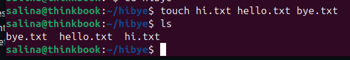

---

### 11. cp (Copy Files and Directories)

**Explanation:**  
The `cp` command copies files or directories from one location to another. The basic syntax is `cp source destination`. To copy directories, use `cp -r` for recursive copying. The `-i` option prompts before overwriting existing files, preventing accidental data loss. Use `-v` for verbose output showing what's being copied. The command preserves file contents but creates new inodes, meaning the copy is independent of the original.

**Command:**
```bash
cp source.txt destination.txt
cp file.txt /home/user/Documents/
cp -r folder1 folder2
```

**Screenshot:**  
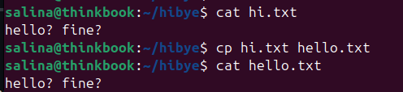

---

### 12. mv (Move or Rename Files)

**Explanation:**  
The `mv` command serves two purposes: moving files/directories to different locations or renaming them. Unlike `cp`, `mv` doesn't create a duplicate; it changes the file's location or name in the file system. The operation is instantaneous within the same file system because it only updates directory entries, not actual data. Use `mv -i` for interactive mode to prevent accidental overwrites. Moving across different file systems actually copies and deletes the original.

**Command:**
```bash
mv oldname.txt newname.txt
mv file.txt /home/user/Documents/
mv folder1 folder2
```

**Screenshot:**  
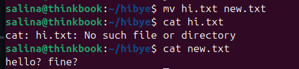

---

### 13. locate (Find Files by Name)

**Explanation:**  
The `locate` command quickly searches for files across the entire file system by querying a pre-built database. It's much faster than `find` because it doesn't search the file system in real-time. The database is updated periodically (usually daily) using `updatedb` command. Use `locate -i` for case-insensitive search. Since it relies on a database, recently created files might not appear until the next database update. Run `sudo updatedb` to manually update the database.

**Command:**
```bash
locate filename
locate -i document
sudo updatedb
```

**Screenshot:**  
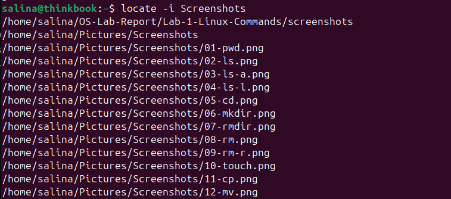

---

### 14. find (Search Files and Directories)

**Explanation:**  
The `find` command searches for files and directories in real-time based on various criteria like name, size, type, modification time, and permissions. Unlike `locate`, it searches the actual file system, so it finds recently created files but is slower. Syntax: `find /path/ -name "pattern"`. Use `-type f` for files only, `-type d` for directories, `-size +100M` for files larger than 100MB, and `-mtime -7` for files modified in last 7 days. It can execute commands on found files using `-exec`.

**Command:**
```bash
find /home -name "*.txt"
find . -type f -size +10M
find /var/log -name "*.log" -mtime -7
find . -name "*.tmp" -delete
```

**Screenshot:**  
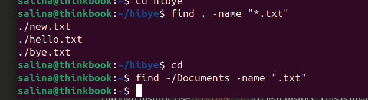

---

## CATEGORY 3: FILE VIEWING AND EDITING

### 15. cat (Concatenate and Display File)

**Explanation:**  
The `cat` command displays the entire content of one or more files on the terminal. It reads files sequentially and outputs them to standard output. You can concatenate multiple files with `cat file1.txt file2.txt > combined.txt`. It's useful for viewing short files, but for large files, consider using `less` or `more` for paginated viewing. The command can also create files: `cat > newfile.txt` lets you type content and save it with Ctrl+D.

**Command:**
```bash
cat filename.txt
cat file1.txt file2.txt
```

**Screenshot:**  
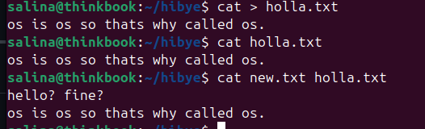

---

### 16. nano (Text Editor)

**Explanation:**  
`nano` is a simple, user-friendly command-line text editor, ideal for beginners. It displays available commands at the bottom of the screen where `^` means Ctrl key. Common commands include `Ctrl+O` to save (write out), `Ctrl+X` to exit, `Ctrl+K` to cut line, `Ctrl+U` to paste, and `Ctrl+W` to search. Unlike `vi/vim`, nano doesn't have different modes, making it more intuitive. It's perfect for quick edits to configuration files or scripts.

**Command:**
```bash
nano filename.txt
```

**Screenshot:**  
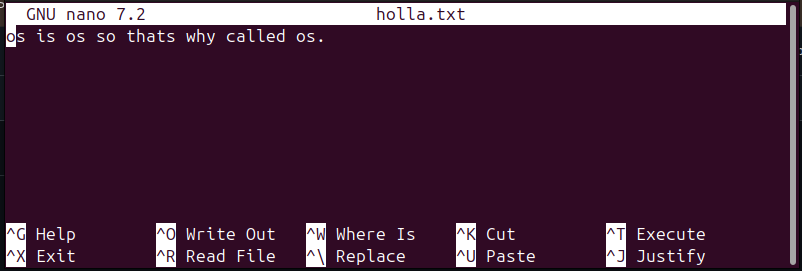

---

### 17. vi/vim (Advanced Text Editor)

**Explanation:**  
`vi` (Visual Editor) and its improved version `vim` (Vi IMproved) are powerful modal text editors available on virtually all Unix systems. Vi operates in different modes: Normal mode (for navigation and commands), Insert mode (for typing text, entered with `i`), and Command mode (entered with `:` for saving/quitting). Save and quit with `:wq`, quit without saving with `:q!`. Despite its steep learning curve, vi is essential for system administrators and when graphical environments are unavailable.

**Command:**
```bash
vi filename.txt
vim filename.txt
```

**Screenshot:**  
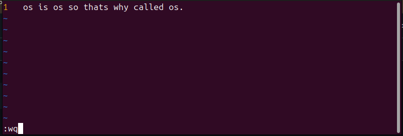

---

### 18. echo (Display Text or Variables)

**Explanation:**  
The `echo` command prints text or variable values to the terminal. It's commonly used in shell scripts to display messages, show variable contents, or create files with content using redirection. Use `echo $VARIABLE` to display environment variable values. The command supports escape sequences with `echo -e` option, such as `\n` for newline and `\t` for tab. Redirection operators `>` (overwrite) and `>>` (append) can write output to files.

**Command:**
```bash
echo "Hello, World!"
echo $HOME
echo -e "Line1\nLine2"
echo "Text content" > file.txt
```

**Screenshot:**  
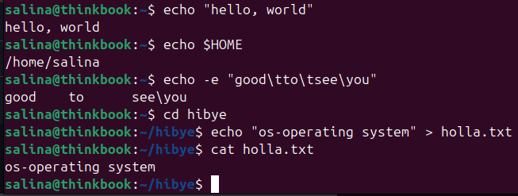

---

## CATEGORY 4: FILE PERMISSIONS AND OWNERSHIP

### 19. chmod (Change File Permissions)

**Explanation:**  
The `chmod` command modifies file permissions in Linux, controlling read (r=4), write (w=2), and execute (x=1) access for owner, group, and others. Use numeric mode: `chmod 755 file` sets rwxr-xr-x (owner: full access, group/others: read and execute). Use symbolic mode: `chmod u+x file` adds execute permission for user. Understanding permissions is crucial for system security and file management. Execute permission on directories allows entering them.

**Command:**
```bash
chmod 755 script.sh
chmod u+x file.txt
chmod -R 644 folder/
```

**Screenshot:**  
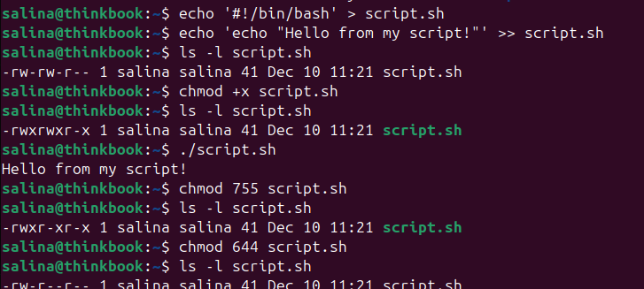

---

### 20. chown (Change Ownership)

**Explanation:**  
The `chown` command changes file and directory ownership. Linux assigns an owner and group to every file. Format: `chown user:group filename`. Only root can change ownership to different users (requires `sudo`). Use `chown -R` for recursive changes on directories. For example, `sudo chown john:developers project/` assigns ownership of project directory to user john and group developers. This is essential for multi-user environments and proper access control.

**Command:**  
```bash
sudo chown username filename
sudo chown user:group filename
sudo chown -R user:group directory/
```

**Screenshot:**  
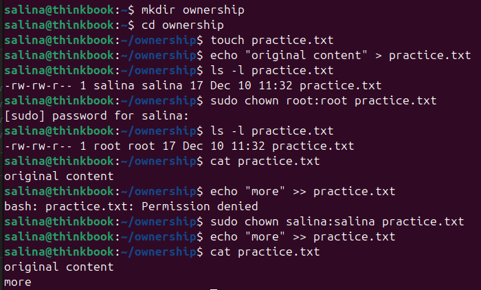

---

## CATEGORY 5: SYSTEM INFORMATION

### 21. uname -a (System Information)

**Explanation:**  
The `uname` command displays system information. The `-a` option shows all available information including kernel name (Linux), network hostname, kernel release version, kernel version with build date, machine hardware name (architecture like x86_64), processor type, and operating system name. This information is crucial for determining system compatibility, debugging, and understanding the OS environment. Different options like `-r` (kernel release) or `-m` (machine hardware) show specific details.

**Command:**
```bash
uname -a
uname -r
uname -m
```

**Screenshot:**  
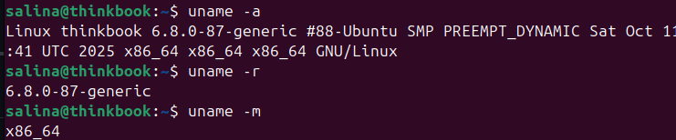

---

### 22. whoami (Current User Identity)

**Explanation:**  
The `whoami` command displays the username of the current effective user. It's simple but useful in scripts to determine who is running the script, especially when switching users with `su` or `sudo`. The command helps verify your identity after using `su` to switch users or when running automated scripts that need to check user context. It returns only the username, unlike `id` which shows user ID, group ID, and group memberships.

**Command:**
```bash
whoami
```

**Screenshot:**  


---

### 23. id (User and Group Information)

**Explanation:**  
The `id` command displays user identity information including user ID (UID), group ID (GID), and all group memberships. It shows both numeric IDs and names. Use `id` for current user, `id username` for specific user, `id -u` for user ID only, `id -g` for primary group ID, and `id -G` for all group IDs. This information is crucial for understanding file permissions, as access control is based on UIDs and GIDs. The command helps troubleshoot permission issues and verify user account configuration.

**Command:**
```bash
id
id username
id -u
id -gn
```

**Screenshot:**  


---

### 24. which (Locate Command Binary)

**Explanation:**  
The `which` command shows the full path of shell commands by searching directories listed in the PATH environment variable. It helps identify which executable will run when you type a command, useful when multiple versions exist. For example, `which python` might show `/usr/bin/python`. If a command isn't found, which returns nothing and exits with non-zero status. This is essential for troubleshooting command conflicts and understanding your system's executable locations.

**Command:**
```bash
which python
which ls
which java
```

**Screenshot:**  
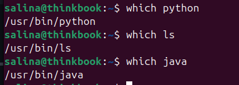

---

### 25. whereis (Locate Binary, Source, and Manual)

**Explanation:**  
The `whereis` command locates the binary, source code, and manual page files for commands. It searches standard locations and is faster than `find` but less flexible. Output typically shows three paths: binary location, manual page location, and source code location (if available). For example, `whereis ls` might show: `ls: /usr/bin/ls /usr/share/man/man1/ls.1.gz`. This is useful for finding documentation and understanding program installation locations.

**Command:**
```bash
whereis ls
whereis python
whereis gcc
```

**Screenshot:**  
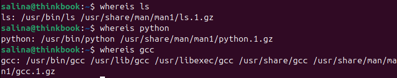

---

## CATEGORY 6: DISK AND STORAGE MANAGEMENT

### 26. df -h (Disk Space Usage)

**Explanation:**  
The `df` (disk free) command displays file system disk space usage. The `-h` option presents information in human-readable format (KB, MB, GB) instead of raw bytes. The output shows total size, used space, available space, usage percentage, and mount point for each file system. This is essential for monitoring storage capacity, identifying full partitions, and preventing disk space issues that can cause system failures or data loss.

**Command:**
```bash
df -h
df -h /home
```

**Screenshot:**  
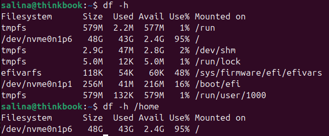

---

### 27. du -sh (Directory Size)

**Explanation:**  
The `du` (disk usage) command estimates file and directory space consumption. The `-s` option provides a summary (total only) instead of listing all subdirectories, while `-h` makes output human-readable. Use `du -sh *` to see sizes of all items in current directory. This command is invaluable for identifying which directories consume the most disk space, helping with cleanup and storage management. Unlike `df` which shows file system level, `du` shows directory level usage.

**Command:**
```bash
du -sh /home/username
du -sh * 
du -h --max-depth=1
```

**Screenshot:**  
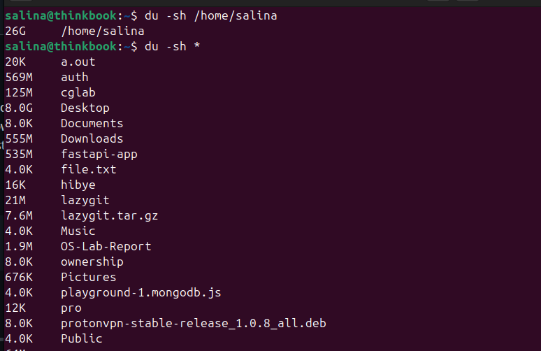

---

## CATEGORY 7: PROCESS MANAGEMENT

### 28. ps (Process Status)

**Explanation:**  
The `ps` command displays information about currently running processes. Without options, it shows processes in the current shell. Use `ps -u $USER` to see all processes belonging to your user, showing PID (Process ID), TTY (terminal), TIME (CPU time), and CMD (command name). The PID is crucial for managing processes. This command is fundamental for understanding process states, CPU time consumption, and identifying which programs are running on the system.

**Command:**
```bash
ps
ps -u $USER
ps aux
```

**Screenshot:**  
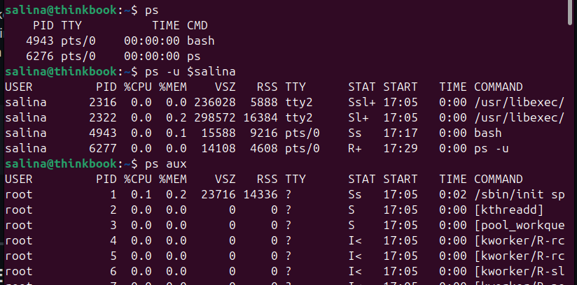

---

### 29. ps aux (Detailed Process Information)

**Explanation:**  
The `ps aux` command provides comprehensive process information for all users. Output includes USER (process owner), PID (process ID), %CPU (CPU utilization percentage), %MEM (memory usage percentage), VSZ (virtual memory size), RSS (resident set size in physical memory), TTY (controlling terminal), STAT (process state), START (start time), TIME (cumulative CPU time), and COMMAND. This detailed view is essential for system monitoring, identifying resource-hungry processes, and troubleshooting performance issues.

**Command:**
```bash
ps aux
ps aux | grep firefox
```

**Screenshot:**  
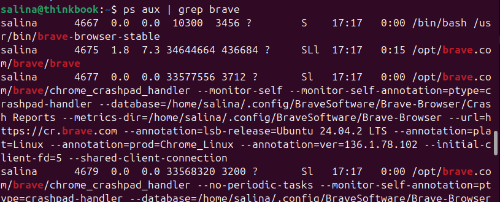

---

### 30. top (Dynamic Process Viewer)

**Explanation:**  
The `top` command provides a real-time, dynamic view of running processes and system resource utilization. It continuously updates (default 3 seconds) showing CPU usage, memory usage, load averages, and process details sorted by CPU consumption. Press `q` to quit, `k` to kill a process, `M` to sort by memory, `P` to sort by CPU, and `h` for help. The header displays system uptime, user count, load averages, task statistics, CPU percentages, and memory/swap usage.

**Command:**
```bash
top
```

**Screenshot:**  


---

### 31. htop (Interactive Process Viewer)

**Explanation:**  
`htop` is an improved, interactive alternative to `top` with a more user-friendly interface, color-coded output, and mouse support. It displays CPU cores individually, shows process tree hierarchy with `F5`, allows easy process killing, and supports vertical and horizontal scrolling. Function keys provide quick actions: F9 to kill process, F6 to sort, F4 to filter. Though not always installed by default (`sudo apt install htop`), it's preferred by many system administrators for process monitoring and management.

**Command:**
```bash
htop
```

**Screenshot:**  
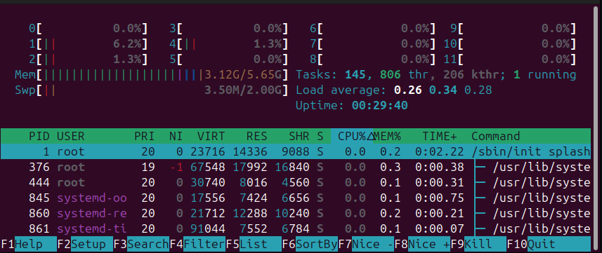

---

### 32. pstree (Process Tree)

**Explanation:**  
The `pstree` command displays running processes in a tree-like hierarchical structure, showing parent-child relationships. This visualization helps understand process spawning, identify process families, and see which processes started others. The tree starts from init/systemd (PID 1). Use `pstree -p` to include PIDs, `pstree -u` to show user transitions, and `pstree username` to show only that user's processes. This is particularly useful for understanding daemon processes and their children.

**Command:**
```bash
pstree
pstree -p
pstree username
```

**Screenshot:**  
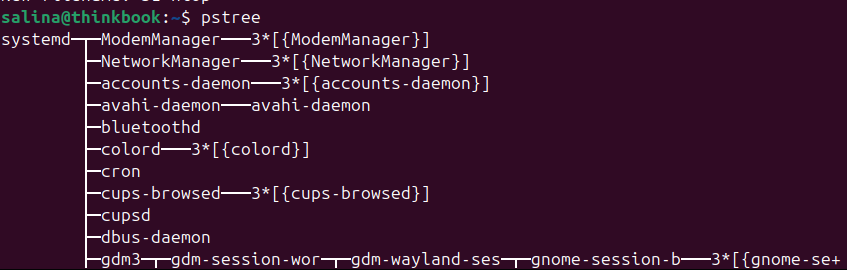

---

### 33. kill (Terminate Process)

**Explanation:**  
The `kill` command sends signals to processes, typically to terminate them. The default signal is SIGTERM (15), which requests graceful termination, allowing processes to clean up. Use `kill -9 PID` (SIGKILL) to forcefully terminate unresponsive processes immediately without cleanup. Find the PID using `ps` or `top` first. Examples: `kill 1234` sends SIGTERM to process 1234, `kill -9 1234` forcefully kills it. Use `kill -l` to list all available signals.

**Command:**
```bash
kill PID
kill -9 PID
kill -15 PID
```

**Screenshot:**  
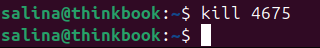

---

### 34. pkill (Kill Processes by Name)

**Explanation:**  
The `pkill` command terminates processes by name instead of PID, making it more convenient than `kill`. It sends signals to all processes matching the specified name pattern. For example, `pkill firefox` terminates all Firefox processes. Use `pkill -9 processname` for forceful termination. The `-u username` option kills processes belonging to a specific user. Be careful as it affects all matching processes simultaneously, potentially closing multiple instances.

**Command:**
```bash
pkill processname
pkill -9 firefox
pkill -u username processname
```

**Screenshot:**  
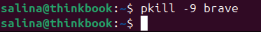

---

### 35. jobs (Background Jobs)

**Explanation:**  
The `jobs` command lists jobs running in the background or stopped in the current shell session. When you append `&` to a command, it runs in the background, freeing the terminal. Jobs are numbered [1], [2], etc. Use `fg %1` to bring job 1 to foreground, `bg %1` to resume stopped job 1 in background. Press Ctrl+Z to stop (suspend) a foreground job. This job control mechanism allows multitasking within a single terminal session.

**Command:**
```bash
jobs
sleep 100 &
jobs
fg %1
```

**Screenshot:**  
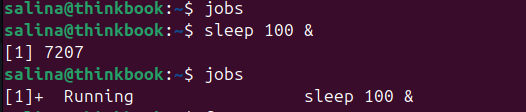

---

### 36. bg (Background Job Control)

**Explanation:**  
The `bg` command resumes suspended (stopped) jobs in the background. When you press Ctrl+Z, it suspends the current foreground job. Use `bg` to continue it in background, or `bg %jobnumber` for specific jobs. This is useful when you start a long-running process and realize you need the terminal for other tasks. Combined with `jobs` and `fg`, it provides comprehensive job control for efficient multitasking within the shell.

**Command:**
```bash
# Start a process, press Ctrl+Z to suspend
bg
bg %1
```

**Screenshot:**  


---

### 37. fg (Foreground Job Control)

**Explanation:**  
The `fg` command brings background or suspended jobs to the foreground, making them the active process that receives terminal input. Use `fg` without arguments to bring the most recent background job forward, or `fg %jobnumber` to specify which job. Once in foreground, you can interact with the process normally. This is particularly useful for text editors or interactive programs you accidentally backgrounded. You can suspend it again with Ctrl+Z if needed.

**Command:**
```bash
fg
fg %1
fg %2
```

**Screenshot:**  
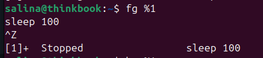

---

### 38. nohup (Run Command Immune to Hangups)

**Explanation:**  
The `nohup` command runs processes that continue running even after you log out or close the terminal. It ignores the HUP (hangup) signal sent when a session terminates. Output is redirected to `nohup.out` file by default. Usage: `nohup command &` runs command in background immune to hangups. This is essential for long-running tasks on remote servers. The process becomes orphaned and continues running under the init/systemd process.

**Command:**
```bash
nohup python script.py &
nohup ./long_process > output.log 2>&1 &
```

**Screenshot:**  
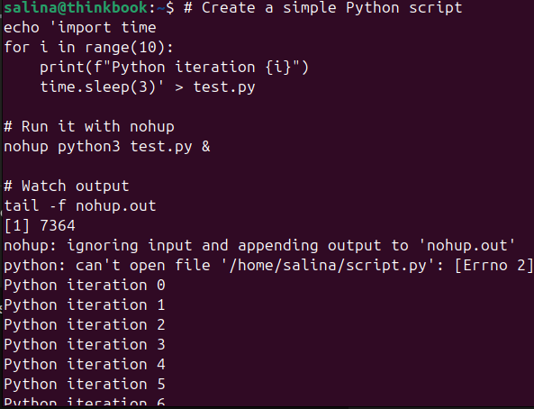

---

## CATEGORY 8: MEMORY MANAGEMENT

### 39. free -h (Memory Usage)

**Explanation:**  
The `free` command displays system memory (RAM) and swap space usage statistics. The `-h` option shows values in human-readable format. Output includes total memory, used memory, free memory, shared memory, buffer/cache memory, and available memory. The "available" column is particularly important as it shows memory that can be made available for applications without swapping. Understanding memory usage is crucial for diagnosing performance issues and determining if additional RAM is needed.

**Command:**
```bash
free -h
free -m
```

**Screenshot:**  
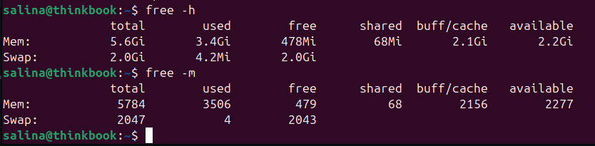

---

### 40. vmstat (Virtual Memory Statistics)

**Explanation:**  
The `vmstat` command reports virtual memory statistics including processes, memory, paging, block IO, traps, and CPU activity. It provides insights into system performance and helps identify bottlenecks. The first line shows averages since boot; subsequent lines show interval statistics. Common usage: `vmstat 2 5` displays statistics every 2 seconds for 5 iterations. Key columns include r (runnable processes), free (free memory), si/so (swap in/out), bi/bo (blocks in/out), and CPU percentages.

**Command:**
```bash
vmstat
vmstat 2 5
vmstat -s
```

**Screenshot:**  
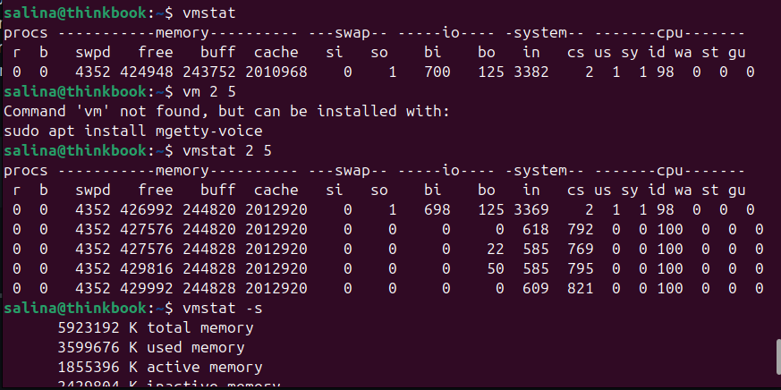

---

## CATEGORY 9: SYSTEM MONITORING AND LOGS

### 41. dmesg (Kernel Ring Buffer)

**Explanation:**  
The `dmesg` command displays messages from the kernel ring buffer, showing kernel and hardware-related messages since boot. It's invaluable for diagnosing hardware issues, driver problems, and system boot errors. Messages include device detection, driver loading, memory initialization, and hardware failures. Use `dmesg | grep -i error` to find errors, `dmesg -T` for human-readable timestamps, and `dmesg -w` to follow new messages. Root privileges may be needed for full access.

**Command:**
```bash
dmesg
dmesg | grep -i usb
dmesg -T
dmesg | tail -50
```

**Screenshot:**  


---

### 42. journalctl (System Logs)

**Explanation:**  
The `journalctl` command queries the systemd journal, displaying system and service logs. It provides centralized logging for all systemd-managed services. Use `journalctl -u service-name` to view logs for specific service, `journalctl -f` to follow logs in real-time (like tail -f), `journalctl --since "1 hour ago"` for time-based filtering, and `journalctl -p err` to show only error messages. This is essential for troubleshooting system issues, monitoring service behavior, and security auditing.

**Command:**
```bash
journalctl
journalctl -u ssh.service
journalctl -f
journalctl --since today
```

**Screenshot:**  
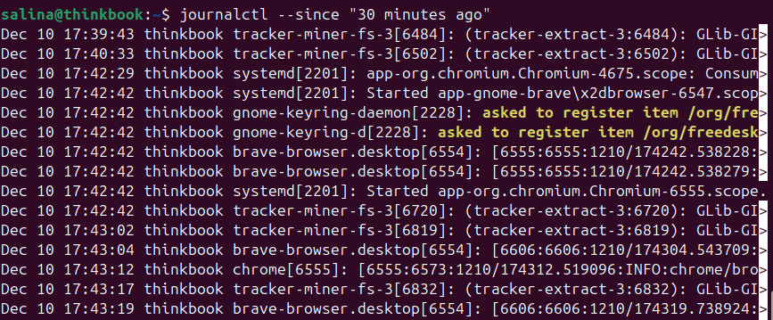

---

### 43. lsof (List Open Files)

**Explanation:**  
The `lsof` (List Open Files) command displays all files currently opened by processes. In Linux, "everything is a file" including regular files, directories, network sockets, pipes, and devices. This command is invaluable for troubleshooting - finding which process is using a file, identifying network connections, and diagnosing "file in use" errors. Use `lsof filename` to see which processes have a file open, `lsof -u username` for files opened by a user, `lsof -i` for network connections, and `lsof -p PID` for files opened by a specific process.

**# LINUX COMMANDS LAB REPORT

**Command:**
```bash
lsof
lsof /var/log/syslog
lsof -u username
lsof -i :80
lsof -p 1234
```

**Screenshot:**  
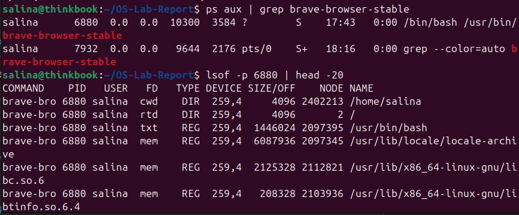

---

### 44. history (Command History)

**Explanation:**  
The `history` command displays previously executed commands stored in the shell history file (~/.bash_history for bash). Each command is numbered. Use `!number` to re-execute a specific command, `!-n` for the nth previous command, `!!` for the last command, and `!string` for the most recent command starting with string. Press Ctrl+R for reverse search through history. Use `history -c` to clear history. This is invaluable for repeating complex commands and auditing user actions.

**Command:**
```bash
history
history 20
!42
!!
```

**Screenshot:**  
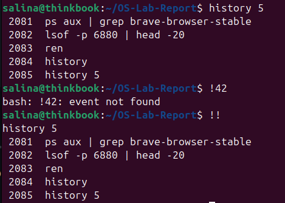

---

### 45. man (Manual Pages)

**Explanation:**  
The `man` command displays the manual (documentation) for commands and system calls. Manual pages are organized into sections: 1 (user commands), 2 (system calls), 3 (library functions), 5 (file formats), 8 (admin commands). Navigate with arrow keys, search with `/pattern`, quit with `q`. Use `man -k keyword` to search manual descriptions. Understanding man pages is crucial for learning command options and usage. For example, `man ls` explains all ls options in detail.

**Command:**
```bash
man ls
man 2 fork
man -k process
```

**Screenshot:**  
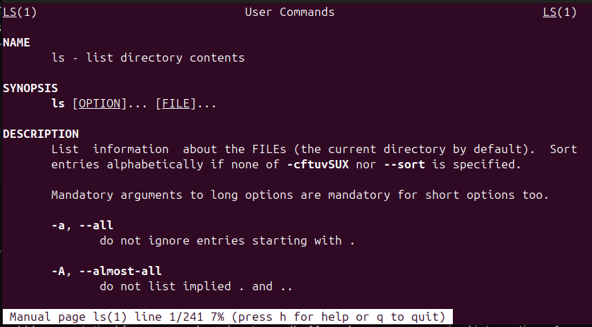

---

## CATEGORY 10: SERVICE AND SYSTEM MANAGEMENT

### 46. systemctl (System Control - Service Management)

**Explanation:**  
The `systemctl` command controls the systemd system and service manager, used in most modern Linux distributions. It manages system services (daemons), showing status, starting, stopping, enabling (auto-start at boot), and disabling services. Examples: `systemctl status apache2` checks Apache status, `sudo systemctl start service-name` starts a service, `sudo systemctl enable service-name` enables auto-start. Use `systemctl list-units --type=service` to see all services.

**Command:**
```bash
systemctl status ssh
sudo systemctl start apache2
sudo systemctl stop apache2
systemctl list-units --type=service
```

**Screenshot:**  
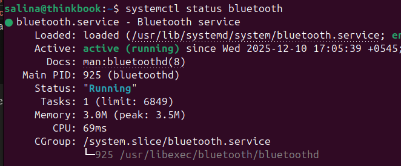

---

### 47. sudo (Execute as Superuser)

**Explanation:**  
The `sudo` (Superuser Do) command executes commands with elevated privileges, typically as root. It's safer than logging in as root because it requires password authentication, logs all actions, and can be configured to allow only specific commands. Use `sudo command` to run a command as root. Configuration in `/etc/sudoers` controls who can use sudo and what they can do. Users must be in the sudo/wheel group.

**Command:**
```bash
sudo apt update
sudo systemctl restart apache2
sudo -i
sudo -u username command
```

**Screenshot:**  
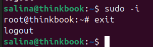

---

### 48. su (Switch User)

**Explanation:**  
The `su` (Switch User) command switches to another user account, defaulting to root if no username specified. Use `su - username` for full login (loads user's environment), or `su username` for simple switch. Use `su -` to become root with root's environment. You need the target user's password unless you're already root. Use `exit` to return to your original user.

**Command:**
```bash
su -
su - username
su username
exit
```

**Screenshot:**  
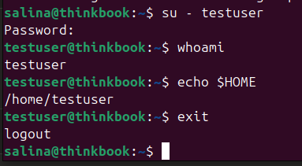

---

## CATEGORY 11: NETWORKING COMMANDS

### 49. ping (Network Connectivity Test)

**Explanation:**  
The `ping` command tests network connectivity between your system and a remote host by sending ICMP echo request packets. It measures round-trip time (RTT) and packet loss, helping diagnose network issues. Use `ping hostname` or `ping IP_address` to test connectivity. Press Ctrl+C to stop. Use `ping -c 4` to send only 4 packets, `ping -i 2` to set 2-second interval between packets.

**Command:**
```bash
ping google.com
ping -c 4 8.8.8.8
ping -i 2 192.168.1.1
```

**Screenshot:**  
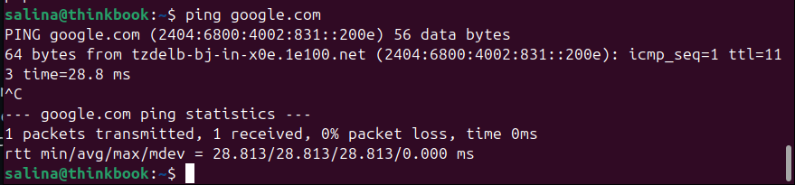

---

### 50. ifconfig (Interface Configuration)

**Explanation:**  
The `ifconfig` command displays and configures network interface parameters. It shows IP addresses, MAC addresses, network masks, broadcast addresses, and interface statistics (packets transmitted/received, errors, collisions). Use `ifconfig` to view all active interfaces, `ifconfig -a` for all interfaces including inactive ones. On modern systems, `ip` command is preferred, but ifconfig remains widely used.

**Command:**
```bash
ifconfig
ifconfig -a
ifconfig eth0
```

**Screenshot:**  
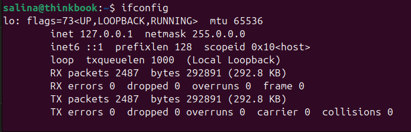

---

### 51. ip addr (IP Address Management)

**Explanation:**  
The `ip addr` command is the modern replacement for `ifconfig`, part of the iproute2 package. It displays and manipulates network interface addresses and properties. Use `ip addr show` to view all interfaces with IP addresses, `ip addr show dev eth0` for specific interface, and `sudo ip addr add 192.168.1.100/24 dev eth0` to add an IP address. The command provides more detailed information than ifconfig including IPv6 addresses, scope, and interface state.

**Command:**
```bash
ip addr
ip addr show
ip addr show dev eth0
ip link show
```

**Screenshot:**  


---

### 52. netstat (Network Statistics)

**Explanation:**  
The `netstat` command displays network connections, routing tables, interface statistics, and protocol statistics. It shows active TCP/UDP connections, listening ports, and network interface information. Use `netstat -tuln` to show all listening TCP/UDP ports with numeric addresses, `netstat -r` for routing table, and `netstat -i` for interface statistics. On some modern systems, `ss` command is the replacement.

**Command:**
```bash
netstat -tuln
netstat -r
netstat -i
netstat -antp
```

**Screenshot:**  
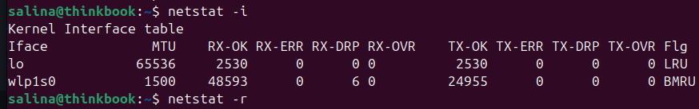

---

### 53. ssh (Secure Shell - Remote Login)

**Explanation:**  
The `ssh` (Secure Shell) command establishes encrypted remote connections to other systems, allowing secure command-line access. It's the standard for remote system administration. Use `ssh username@hostname` to connect, `ssh -p 2222 user@host` for non-standard port, and `ssh -i keyfile user@host` for key-based authentication. All communication is encrypted.

**Command:**
```bash
ssh username@192.168.1.100
ssh -p 2222 user@example.com
ssh user@host 'ls -la'
ssh -i ~/.ssh/id_rsa user@host
```

**Screenshot:**  
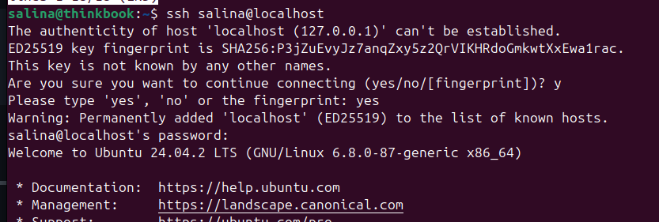

---

### 54. scp (Secure Copy)

**Explanation:**  
The `scp` command securely copies files between local and remote systems using SSH protocol. It encrypts both authentication credentials and transferred data. Use `scp localfile user@host:/remote/path/` to copy to remote system, `scp user@host:/remote/file /local/path/` to copy from remote, and `scp -r directory/ user@host:/path/` for recursive directory copy.

**Command:**
```bash
scp file.txt user@192.168.1.100:/home/user/
scp user@host:/remote/file.txt /local/directory/
scp -r folder/ user@host:/destination/
scp -P 2222 file.txt user@host:/path/
```

**Screenshot:**  
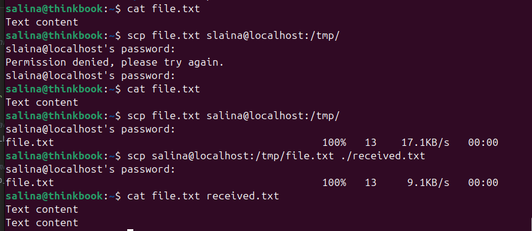

---

### 55. curl (Transfer Data with URLs)

**Explanation:**  
The `curl` command transfers data to or from servers using various protocols (HTTP, HTTPS, FTP, etc.). Unlike wget, curl displays output to stdout by default. Use `curl URL` to fetch content, `curl -O URL` to save with original filename, `curl -I URL` to fetch only HTTP headers, and `curl -X POST -d "data" URL` for POST requests.

**Command:**
```bash
curl https://api.example.com/data
curl -O https://example.com/file.zip
curl -I https://google.com
curl -X POST -d "param=value" https://api.example.com
```

**Screenshot:**  
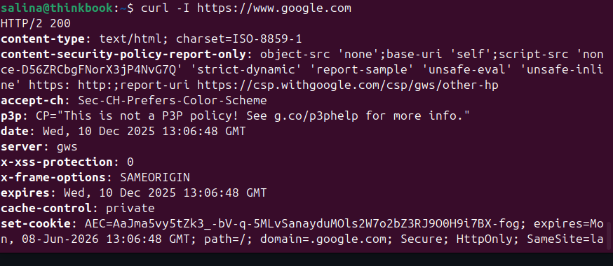

---

### 56. wget (Download Files from Web)

**Explanation:**  
The `wget` command downloads files from the internet using HTTP, HTTPS, or FTP protocols. It supports resuming interrupted downloads, recursive downloads, and background operation. Use `wget URL` to download a file, `wget -c URL` to resume interrupted download, `wget -r URL` for recursive download of entire websites, and `wget -b URL` for background download.

**Command:**
```bash
wget https://example.com/file.zip
wget -c https://example.com/largefile.iso
wget -O custom_name.pdf https://example.com/document.pdf
```

**Screenshot:**  
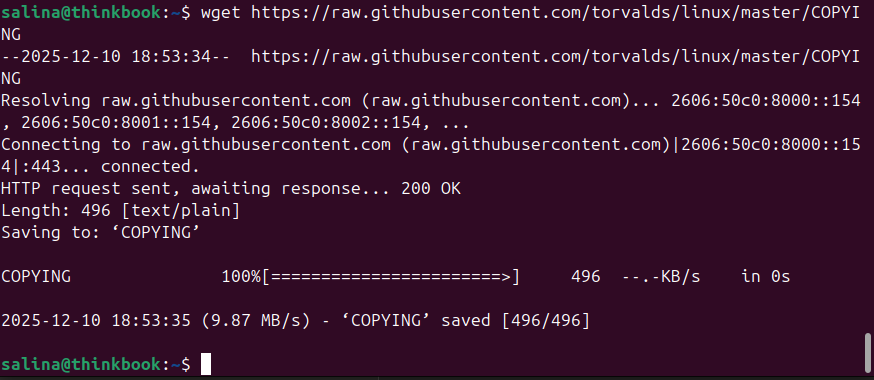

---

## CATEGORY 12: FILE COMPRESSION AND ARCHIVING

### 57. tar (Archive Files)

**Explanation:**  
The `tar` (Tape Archive) command creates, extracts, and manages archive files. It bundles multiple files/directories into a single file, optionally with compression. Use `tar -czf archive.tar.gz directory/` to create compressed archive, `tar -xzf archive.tar.gz` to extract, `tar -tzf archive.tar.gz` to list contents. Options: -c (create), -x (extract), -t (list), -z (gzip), -j (bzip2), -v (verbose), -f (filename).

**Command:**
```bash
tar -czf backup.tar.gz /home/user/Documents/
tar -xzf archive.tar.gz
tar -tzf archive.tar.gz
tar -xzf archive.tar.gz -C /destination/path/
```

**Screenshot:**  


---

### 58. gzip/gunzip (Compress/Decompress Files)

**Explanation:**  
The `gzip` command compresses files using the GNU zip algorithm, reducing file size. It replaces the original file with a compressed version having .gz extension. Use `gzip filename` to compress, `gunzip filename.gz` or `gzip -d filename.gz` to decompress. The `-k` option keeps the original file. Compression level ranges from 1 (fastest) to 9 (best compression).

**Command:**
```bash
gzip file.txt
gunzip file.txt.gz
gzip -k file.txt
gzip -9 largefile.log
```

**Screenshot:**  


---

### 59. zip/unzip (Compress/Extract ZIP Archives)

**Explanation:**  
The `zip` and `unzip` commands create and extract ZIP archives, the most common cross-platform compression format. Use `zip archive.zip file1 file2` to create archive, `zip -r archive.zip directory/` for recursive directory compression, and `unzip archive.zip` to extract. Use `unzip -l archive.zip` to list contents.

**Command:**
```bash
zip archive.zip file1.txt file2.txt
zip -r project.zip project_folder/
unzip archive.zip
unzip -l archive.zip
```

**Screenshot:**  


---

## CATEGORY 13: TEXT PROCESSING AND SEARCH

### 60. grep (Search Text Patterns)

**Explanation:**  
The `grep` (Global Regular Expression Print) command searches for text patterns within files or input streams. It's powerful for filtering output, searching logs, and finding specific content. Use `grep -i` for case-insensitive search, `grep -r` for recursive directory search, `grep -n` to show line numbers, and `grep -v` to invert match. Commonly used with pipes to filter other command outputs.

**Command:**
```bash
grep "pattern" filename.txt
grep -i "error" logfile.log
ps aux | grep firefox
grep -r "TODO" /home/user/project/
```

**Screenshot:**  


---

## CONCLUSION

This lab report covered **60 essential Linux commands** organized into **13 categories**, with focus on operating system concepts including process management, memory management, file systems, networking, and system administration. These commands provide practical understanding of OS principles studied in theory:

### Key Learning Outcomes:

**Process Management (Category 7):** Commands like ps, top, kill, and job control demonstrate CPU scheduling, process states, and inter-process communication. Understanding process hierarchies through pstree and managing background jobs provides insight into how operating systems handle concurrent execution.

**Memory Management (Category 8):** The free and vmstat commands reveal physical and virtual memory usage, paging, and buffer management. These tools help visualize concepts like memory allocation, swapping, and the difference between used and available memory.

**File Systems (Categories 1-3, 4):** Navigation, permissions, and storage commands illustrate inode structures, access control lists, and disk management. The hierarchical file system structure becomes clear through practical navigation and file operations.

**Networking (Category 11):** Network commands show TCP/IP stack implementation, socket connections, and protocol operations. Tools like netstat, ping, and ssh demonstrate how processes communicate over networks and how the OS manages network interfaces.

**System Administration (Categories 10, 9):** Service management with systemctl and monitoring through journalctl demonstrate OS initialization, daemon processes, and system calls. These commands reveal how modern Linux systems use systemd for service orchestration.

### Command Category Summary:
1. **File System Navigation** - 5 commands (pwd, ls variants, cd)
2. **File and Directory Operations** - 9 commands (mkdir, rm, cp, mv, touch, find, locate)
3. **File Viewing and Editing** - 4 commands (cat, nano, vi/vim, echo)
4. **File Permissions and Ownership** - 2 commands (chmod, chown)
5. **System Information** - 5 commands (uname, whoami, id, which, whereis)
6. **Disk and Storage Management** - 2 commands (df, du)
7. **Process Management** - 11 commands (ps variants, top, htop, kill, pkill, pstree, jobs, bg, fg, nohup)
8. **Memory Management** - 2 commands (free, vmstat)
9. **System Monitoring and Logs** - 5 commands (dmesg, journalctl, lsof, history, man)
10. **Service and System Management** - 3 commands (systemctl, sudo, su)
11. **Networking Commands** - 8 commands (ping, ifconfig, ip addr, netstat, ssh, scp, curl, wget)
12. **File Compression and Archiving** - 3 commands (tar, gzip/gunzip, zip/unzip)
13. **Text Processing and Search** - 1 command (grep)

### Practical Applications:

The commands learned in this lab have direct applications in:
- **System Administration:** Managing servers, monitoring performance, troubleshooting issues
- **Software Development:** Navigating codebases, managing processes, using version control
- **DevOps and Cloud Computing:** Automating deployments, managing remote servers, monitoring applications
- **Cybersecurity:** Analyzing logs, monitoring network connections, managing file permissions
- **Academic Research:** Understanding OS internals, conducting performance experiments, analyzing system behavior

### Connection to OS Theory:

These practical commands reinforce theoretical concepts from Operating System Concepts (Silberschatz et al.):
- **Chapter 3 (Processes):** ps, top, kill commands show process control blocks and process scheduling
- **Chapter 9 (Virtual Memory):** free, vmstat demonstrate paging and memory management
- **Chapter 11 (File Systems):** File operations show inode implementation and directory structures
- **Chapter 16 (Security):** chmod, chown implement access control mechanisms
- **Chapter 17 (Networks):** Network commands demonstrate distributed systems concepts

Mastering these commands provides hands-on experience with operating system internals and prepares students for advanced topics in system programming, kernel development, and understanding real-world OS implementations in production environments.

---


